# Zero Human: 2-Hour Hackathon MVP Execution Plan

> **The 2-Hour North Star:** Prove that two people can build and operate an autonomous company that gets a real person to pay real money today, delivers value automatically, and improves itself using real human feedback via Terac.

---

## 1. Executive Summary & Core Hypothesis

### Core Hypothesis Statement
> **"We believe that [Hackathon Founders / Tech Startups] have an urgent need for [Actionable Competitor Intelligence & Viral Growth Playbooks]. We believe that our [Zero-Human Autonomous Research & Strategy Agent] will solve it in under 5 minutes. We will know we are right when at least one real person pays $10–$20 and receives their report live."**

### Primary & Secondary KPIs
| Priority | KPI | Target | Verification Method |
| :--- | :--- | :--- | :--- |
| **P0 (Primary)** | **Real Revenue Collected** | **$10 – $50+** | Live Stripe Dashboard / Receipt |
| **P1 (Secondary)** | **Autonomous Delivery** | **< 5 min latency** | Automated Agent Run Logs / Output Artifact |
| **P2 (Tertiary)** | **Terac Human Preference Loop** | **1 Completed Study** | Terac MCP Before-vs-After Quality Delta |
| **P3 (Sponsor)** | **Band / Superserve / Linq** | **Integrated cleanly** | Agent Handoff / Sandbox Logs |

---

## 2. Team Split & Division of Firepower

```
+-------------------------------------------------------------------------------+
|                                  THE 2-HOUR DUO                                |
+------------------------------------+------------------------------------------+
|  NIHAR (Chief Architect / AI Core)  |  VACHAN (Chief Revenue / Product & Demo) |
|  * High compute credit allocation   |  * Rapid frontend, Stripe & QR codes    |
|  * Heavy multi-step agent pipeline |  * Floor sales & customer acquisition    |
|  * Terac MCP Human-in-the-Loop     |  * Customer interviews & feedback loop   |
|  * Deep reasoning & data delivery  |  * Demo orchestration & deck/pitching    |
+------------------------------------+------------------------------------------+
```

---

## 3. Trello-Style Kanban Board

```
====================================================================================================
|                                     ZERO HUMAN KANBAN BOARD                                      |
====================================================================================================

[ 📋 BACKLOG / FORBIDDEN ]       [ ⏳ 0:00–0:15: STRATEGY ]       [ 🏗️ 0:15–0:30: SCAFFOLDING ]
- User Auth / Login              - [ALL] Lock $20 Offer Pitch     - [NIHAR] Multi-Agent Pipeline
- Custom Database Schemas        - [ALL] Define Core Deliverable  - [NIHAR] Terac MCP Study Config
- Elaborate SaaS Dashboard       - [ALL] Assign Target Audiences  - [VACHAN] Stripe Link & QR Code
- Legacy Dopa Architecture       - [ALL] Set Up Env & API Keys    - [VACHAN] 1-Page Minimal UI/Form
- Complex Frontend Animations    - [VACHAN] Prep Prospect List    - [VACHAN] Pitch Script Ready

----------------------------------------------------------------------------------------------------

[ ⚡ 0:30–1:15: SELL & BUILD ]    [ 🎯 1:15–1:40: FIRST ORDER ]    [ 🏆 1:40–2:00: DEMO & SUBMIT ]
- [NIHAR] Agent Research Loop    - [ALL] Trigger 1st Live Order   - [ALL] Run End-to-End Rehearsal
- [NIHAR] Run Terac A/B Study    - [NIHAR] Verify Output Quality  - [NIHAR] Export Before/After Proof
- [NIHAR] Output PDF/HTML Gen    - [VACHAN] Live Customer Review  - [VACHAN] Stripe Balance Screenshot
- [VACHAN] 10 Pitches on Floor   - [VACHAN] Record Testimonial    - [VACHAN] 3-Minute Demo Flow
- [VACHAN] Secure 1st Paid Order - [NIHAR] Hotfix via Feedback    - [ALL] Submit Github & Devpost
====================================================================================================
```

### Detailed Card Definitions

#### Column 1: 📋 Backlog & Anti-Patterns (STRICT DO NOT BUILD)
* 🚫 **NO Authentication / User Accounts**: Use URL query parameters or session IDs.
* 🚫 **NO Relational Database Overkill**: Use memory, local JSON, or filesystem storage.
* 🚫 **NO Complex CSS Framework Setup**: Minimal clean Vanilla CSS or basic modern components.
* 🚫 **NO Legacy Dopa Code Porting**: Treat Dopa purely as conceptual experience. Blank slate today.
* 🚫 **NO Speculative Features**: If a task can be done manually during the test run, don't write code for it.
* **NO fake data

---

#### Column 2: ⏳ Phase 1 (0:00 – 0:15) — Strategy & Offer Lock
* 🎴 **CARD 1.1: Lock the Single Paid Offer** `[ALL]`
  * **Description**: Formulate the 1-sentence value proposition.
  * **Selected Offer**: *"For $15, give us your startup URL and target market, and our autonomous agent squad delivers a 5-pillar competitive teardown, customer persona matrix, and 10 tailored outreach angles in 3 minutes."*
  * **Acceptance Criteria**: Both team members recite the exact same pitch word-for-word.
* 🎴 **CARD 1.2: Environment & Secret Configuration** `[ALL]`
  * **Description**: Populate `.env` with OpenAI / Anthropic / Gemini, Terac API keys, and Stripe credentials.
  * **Acceptance Criteria**: All API client connections return 200 OK.

---

#### Column 3: 🏗️ Phase 2 (0:15 – 0:30) — Rapid Scaffolding & Payment Rails
* 🎴 **CARD 2.1: Stripe Payment Link & Mobile QR Code** `[VACHAN]`
  * **Assignee**: Vachan
  * **Description**: Create a live $10 / $15 / $20 Stripe Payment Link with Apple Pay / Credit Card enabled. Generate a high-res QR code saved to phone lock screen and printed/displayed.
  * **Acceptance Criteria**: Test purchase with $1 or live card validates webhook/success redirect.
* 🎴 **CARD 2.2: Minimal Web Input Interface** `[VACHAN]`
  * **Assignee**: Vachan
  * **Description**: 1 clean page: Company Name, Website URL, Target Niche, Customer Email + Stripe redirect button.
  * **Acceptance Criteria**: Form posts cleanly to the backend runner endpoint.
* 🎴 **CARD 2.3: Agent Architecture & Prompt Scaffolding** `[NIHAR]` *(Heavy Task - High Compute)*
  * **Assignee**: Nihar
  * **Description**: Construct the core agent runner:
    1. **Scout Agent**: Fetches company website & meta tags.
    2. **Analyst Agent**: Formulates competitive positioning & gaps.
    3. **Copywriter Agent**: Generates high-converting growth plays.
  * **Acceptance Criteria**: Script takes a raw URL and prints clean structured JSON report.
* 🎴 **CARD 2.4: Terac MCP Human-in-the-Loop Setup** `[NIHAR]` *(Hard Task)*
  * **Assignee**: Nihar
  * **Description**: Wire Terac MCP to evaluate two agent-generated headline/pitch variants (Variant A vs Variant B) with 5–10 real human raters.
  * **Acceptance Criteria**: Script successfully dispatches study and retrieves crowd verdict.

---

#### Column 4: ⚡ Phase 3 (0:30 – 1:15) — Parallel Build & Floor Hustle
* 🎴 **CARD 3.1: Floor Sales Blitz (10 Pitches -> 1 Paid Customer)** `[VACHAN]`
  * **Assignee**: Vachan
  * **Description**: Walk the hackathon room. Target founders, mentors, and hackers building products.
  * **Target**: 10 conversations $\rightarrow$ 5 live demos $\rightarrow$ 1 paid Stripe transaction.
  * **Pitch**: *"We built an autonomous AI consultant for this hackathon. Scan this QR code, pay $15, and within 3 minutes our agent delivers your startup's competitor audit and growth playbook."*
  * **Acceptance Criteria**: Real payment received in Stripe Balance (verified via screenshot).
* 🎴 **CARD 3.2: Deliverable Formatter (HTML/Markdown Report)** `[NIHAR]`
  * **Assignee**: Nihar
  * **Description**: Transform raw agent output into a polished, high-value executive intelligence report.
  * **Acceptance Criteria**: Clean, formatted PDF/HTML deliverable containing executive summary, market map, and actionable outreach templates.
* 🎴 **CARD 3.3: Execute Terac Human Evaluation Study** `[NIHAR]` *(Heavy Credit Runway)*
  * **Assignee**: Nihar
  * **Description**: Launch real Terac study: Have real humans vote on the deliverable quality / copy persuasiveness. Feed winning variant back into the agent's final output engine.
  * **Acceptance Criteria**: Store before-vs-after evidence JSON/logs in repository.
* 🎴 **CARD 3.4: Band Multi-Agent Orchestration (Optional Sponsor Track)** `[NIHAR]`
  * **Assignee**: Nihar
  * **Description**: Register agent roles in Band (Scout $\rightarrow$ Analyst $\rightarrow$ Optimizer) with agentic handoffs.
  * **Acceptance Criteria**: Trace log showing multi-agent handoff.

---

#### Column 5: 🎯 Phase 4 (1:15 – 1:40) — First Customer Delivery & Validation
* 🎴 **CARD 4.1: Run Live Customer Job** `[NIHAR]`
  * **Assignee**: Nihar
  * **Description**: Ingest the paid customer's URL and trigger the autonomous pipeline end-to-end.
  * **Acceptance Criteria**: Deliverable generated without manual code interventions.
* 🎴 **CARD 4.2: Customer Delivery & Live Feedback Interview** `[VACHAN]`
  * **Assignee**: Vachan
  * **Description**: Sit with the paid customer. Show them the deliverable. Ask: *"What is the most useful part? What would make this worth 10x more?"*
  * **Acceptance Criteria**: 2-minute video or audio recording / quote of customer reacting to the delivered output.
* 🎴 **CARD 4.3: Real-Time Agent Tuning** `[NIHAR]`
  * **Assignee**: Nihar
  * **Description**: Adjust agent prompts based on customer feedback and Terac crowd scores.
  * **Acceptance Criteria**: Version 2 output generated showing measurable improvement.

---

#### Column 6: 🏆 Phase 5 (1:40 – 2:00) — Demo Polish & Judging Lock
* 🎴 **CARD 5.1: Proof Artifact Assembly** `[ALL]`
  * **Description**: Gather the 4 pieces of undeniable evidence:
    1. Stripe Live Payment receipt ($15+).
    2. Terac Study results (Before vs After improvement).
    3. Terminal / Agent execution trace showing zero-human operation.
    4. Delivered customer report & customer quote.
* 🎴 **CARD 5.2: 3-Minute Demo Run-Through** `[ALL]`
  * **Description**: Practice the live pitch script. Vachan presents business/customer/revenue; Nihar walks through the autonomous multi-agent architecture and Terac feedback loop.
  * **Acceptance Criteria**: Rehearsed under 3 minutes with zero slides needed (live browser only).

---

## 4. The 120-Minute Timeline Matrix

```mermaid
gantt
    title 2-Hour Zero-Human MVP Sprint
    dateFormat  X
    axisFormat %s min

    section Strategy
    Lock Offer & Setup (Both)       :done, 0, 15

    section Nihar (Compute / Agent / Terac)
    Agent Pipeline Scaffolding      :active, 15, 30
    Terac MCP Integration & Prompts :30, 60
    Report Generator & Multi-Agent  :60, 75
    Live Customer Job Execution     :75, 100
    Before/After Evidence Export    :100, 120

    section Vachan (Revenue / Sales / UI)
    Stripe Link & QR Code Scaffolding :active, 15, 30
    Floor Sales Blitz (10 Pitches)    :30, 75
    Close 1st Paid Customer           :75, 80
    Customer Delivery & Testimonial   :80, 100
    Demo Polish & Pitch Rehearsal     :100, 120
```



---

## 5. Sales & Customer Acquisition Playbook (For Vachan)

### The 30-Second Hackathon Floor Pitch
> *"Hey! We're building a zero-human autonomous agency for this hackathon. If you give us your project URL right now, our agent squad will crawl your product, dissect your top 3 competitors, and build a customized customer acquisition playbook in 3 minutes.*
> 
> *It's $15 on Stripe (Apple Pay works). We already have the agents running live. Want to be our first paid test case?"*

### Objection Handling
| Customer Says | Vachan Responds |
| :--- | :--- |
| *"I don't have $15 right now."* | *"How about $5? We just want a real transaction to prove the business model. Scan here with Apple Pay."* |
| *"What do I actually get?"* | *"A 4-page intelligence brief: competitor vulnerabilities, high-intent buyer personas, and 5 cold email scripts tailored to your specific tech."* |
| *"Is this just ChatGPT?"* | *"No, it's a multi-agent pipeline connected to live web scraping and human preference optimization via Terac crowd ratings."* |

---

## 6. Technical Architecture & Agent Specs (For Nihar)

```
                       +-----------------------------+
                       |    Customer Payment ($15)   |
                       |       (Stripe Webhook)      |
                       +--------------+--------------+
                                      |
                                      v
                       +-----------------------------+
                       |   Agent 1: Web Scout        |
                       |   - Crawls URL & Meta tags  |
                       |   - Extracts core value prop|
                       +--------------+--------------+
                                      |
                                      v
                       +-----------------------------+
                       |   Agent 2: Strategist       |
                       |   - Competitor mapping      |
                       |   - Target persona scoring  |
                       +--------------+--------------+
                                      |
                                      v
                       +-----------------------------+
                       |   Terac Human Preference    |
                       |   - Raters score Variant A/B|
                       |   - Selects highest clarity |
                       +--------------+--------------+
                                      |
                                      v
                       +-----------------------------+
                       |   Agent 3: Publisher        |
                       |   - Formats clean HTML/PDF  |
                       |   - Dispatches email/link   |
                       +-----------------------------+
```

### Terac Study Specification
```json
{
  "study_type": "comparison_preference",
  "prompt": "Which of these two startup growth strategies is more actionable and specific for a B2B SaaS founder?",
  "variant_a": "{{strategy_draft_a}}",
  "variant_b": "{{strategy_draft_b}}",
  "participants": 5,
  "target_cohort": "general_population",
  "metrics": ["actionability", "clarity", "willingness_to_use"]
}
```

---

## 7. The 3-Minute Live Hackathon Demo Script

### Minute 1: The Problem & The Paid Proof (Vachan)
1. **The Hook**: "Most AI hackathon projects build cool tech that nobody pays for. We built an autonomous company from scratch in 2 hours with one goal: make real money autonomously."
2. **The Proof**: Open Stripe Dashboard live on screen showing `$15.00` real balance transaction.
3. **The Customer**: Introduce the customer or show the 10-second video reaction.

### Minute 2: Autonomous Engine & Terac Human Loop (Nihar)
1. **The Pipeline**: Show terminal/agent logs processing the input URL in real time.
2. **The Terac Loop**: Show the Terac MCP study log:
   - "Our agent generated two growth angles, dispatched a real-time study to human raters on Terac, got an 80% preference for Variant B, and autonomously adopted the winning strategy."
3. **The Deliverable**: Show the finished high-value output generated for the customer.

### Minute 3: Scalability & The Zero-Human Vision (Both)
1. **Unit Economics**: "$15 revenue, $0.18 LLM/API cost = 98% gross margin."
2. **Closing Statement**: "Zero employees. Zero manual intervention. Real customer. Real revenue. Built in 120 minutes."

---

## 8. Definition of Done Checklist

- [ ] **Stripe Link Live**: Accepting real credit card / Apple Pay transactions.
- [ ] **1+ Real Paid Customer**: At least one external hackathon participant/judge has paid real money.
- [ ] **Agent Pipeline Functional**: Takes URL $\rightarrow$ extracts info $\rightarrow$ outputs growth intelligence.
- [ ] **Terac Study Completed**: Evidence of human rater feedback improving the agent output.
- [ ] **Before/After Evidence Logged**: Clear documentation of product improvement based on Terac.
- [ ] **Demo Rehearsed**: 3-minute strict limit; no slides, 100% live software and receipts.
